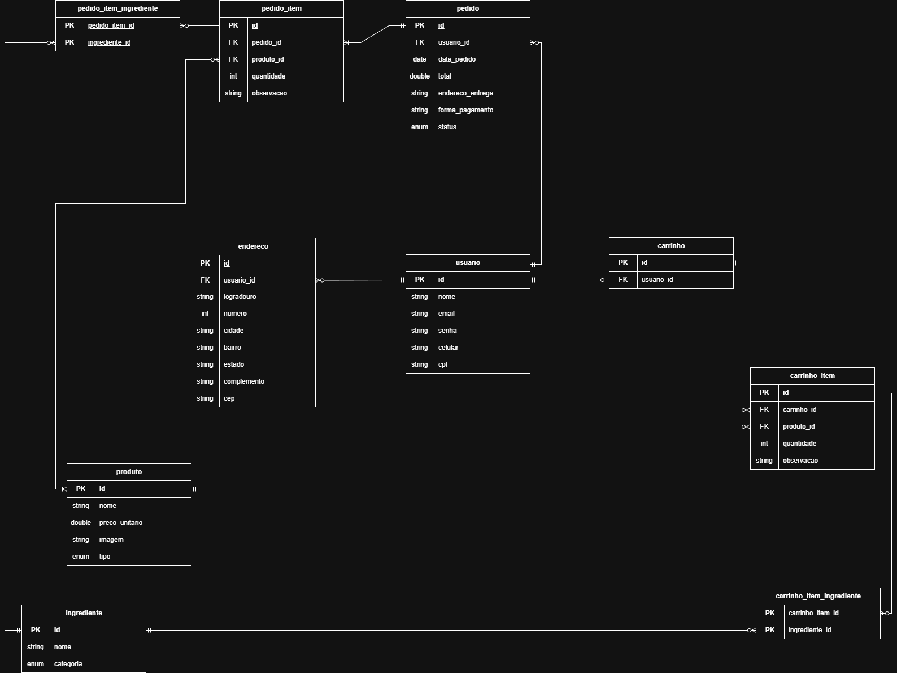

# 🖥️ Projeto de Estudo - Marmitaria

## 💡 Sobre o Projeto

O projeto é um sistema de gerenciamento de **Marmitaria**, permitindo cadastro e gerenciamento de produtos, ingredientes, usuários, carrinhos e pedidos.  
Foi desenvolvido com foco em back-end robusto, utilizando Spring boot e com JWT para autenticação e validação de dados.

Este sistema realiza:
- Gerenciamento e autenticação de usuários
- Registro de endereço para usuários
- Registro de produtos e ingredientes
- Montagem de carrinho com diferentes itens
- Conclusão de pedidos, informando endereço e forma de pagamento
- Integração com serviços externos como ViaCEP

Futuras atualizações:
- Relatórios de pedidos de produtos
- Implementação de estoque de produtos.

---

## 🚀 Tecnologias Utilizadas
- Java 17  
- Spring Boot 3.3.6  
- Spring Security + JWT  
- Spring Data JPA
- Spring Validation
- Spring Web   
- Postgres  
- Lombok  
- Migrations Flyway  
- Docker Container

---

## 📦 Como Executar o Projeto
Antes de executar, é necessário reiniciar o container Docker e limpar os volumes (para resetar o banco de dados e garantir um ambiente limpo de testes).

Para usuários Linux / WSL / macOS:
Execute os comandos abaixo com sudo, pois o Docker pode exigir permissões administrativas:

- `sudo docker compose down -v`
- `sudo docker compose up -d`

---

Para usuários Windows (Docker Desktop):
Você pode executar os mesmos comandos sem sudo:

- `docker compose down -v`
- `docker compose up -d`

Esses comandos garantem que o banco de dados será reconfigurado corretamente antes dos testes.
Se não forem executados, os testes podem falhar devido a dados persistentes ou estado inconsistente.  
Ele inicializará por padrão na porta **5432**.

---

### Com Maven:
```bash
./mvnw spring-boot:run
```

---

## 🔐 Autenticação

Autenticação baseada em JWT, com token Bearer enviado no header Authorization.  
Talvez seja necessário configurar o postman para acessar endpoints restritos.

### 🔸 Login

```http
POST /auth/login
```

Request:
```json
{ "email": "email@exemplo.com", "senha": "SenhaForte123" }
```
Response:
```json
{ "token": "eyJhbGciOiJIUzI1NiJ9..." }
```

---

## 🧩 Modelo Entidade-Relacionamento (MER)


- `usuario`: id, nome, email, senha, celular, cpf
- `endereco`: id, logradouro, numero, cidade, bairro, estado, complemento, cep, usuario_id (FK)
- `produto`: id, nome, preco_unitario, imagem, tipo
- `ingrediente`: id, nome, categoria
- `carrinho`: id, usuario_id (FK)
- `carrinho_item`: id, quantidade, observacao, carrinho_id (FK), produto_id (FK) 
- `carrinho_item_ingrediente`: carrinho_item_id (PK), ingrediente_id (PK) `Chave composta`
- `pedido`: id, data_pedido, total, endereco_entrega, forma_pagamento, status, usuario_id (FK)
- `pedido_item`: id, quantidade, observacao, pedido_id (FK), produto_id (FK)
- `pedido_item_ingrediente`: pedido_item_id (PK), ingrediente_id (PK) `Chave composta`



---

## 📜 Regras de Negócio
### 👤 1. Agregado: Usuário
**Entidade raiz:** `Usuario`  
**Outras entidades relacionadas:** `Endereco`, `Carrinho`, `Pedido`

### Regras

- Um usuário pode ter **nenhum ou 3** endereços cadastrados.
- Um endereço pertence a **somente um** usuário. Podem existir **endereços iguais** para **diferentes usuários**.
- Um usuário **não pode ter** endereços repetidos.
- **Não é possível** alterar dados do endereço.
- Um usuário pode ter **nenhum ou 1** carrinho.
- Um usuário pode ter **nenhum ou vários** pedidos.
- Campos obrigatórios do usuário: `nome`, `email`, `senha`, `celular`, `cpf`
- `email` e `cpf` devem ser **únicos** no sistema.
- O usuário deve estar autenticado (**JWT**) para acessar recursos privados.

---

### 📦 2. Agregado: Produto
**Entidade raiz:** `Produto`  
**Outras entidades relacionadas:** `Ingrediente`  
**Valores de domínio (enum):**
- Tipo de produto: `MARMITA_PEQUENA`, `MARMITA_GRANDE`, `BEBIDA`
- Categoria de ingrediente: `PROTEINA`, `CARBOIDRATO`, `COMPLEMENTO`  


### Regras

- Campos obrigatórios de `Produto`: **nome**, **precoUnitario**, **tipo**.
- Campos obrigatórios de `Ingrediente`: **nome**, **categoria**.
- Produtos do tipo `MARMITA` devem ter ingredientes, do tipo `BEBIDA` não.
- Cada ingrediente possui uma `CATEGORIA` definida pelo enum `CategoriaIngrediente`.
- Produtos e ingredientes são apenas **itens de referência**, a montagem das marmitas ocorre no carrinho.
- Não podem ter Produtos e Ingredientes com **nomes** repetidos.
- **Preço** de produto não pode ser **negativo** e não pode passar de R$ **9999.99**.

---

### 🛒 3. Agregado: Carrinho
**Entidade raiz:** `Carrinho`  
**Outras entidades relacionadas:** `CarrinhoItem`, `CarrinhoItemIngrediente`, `Produto`, `Ingrediente`

### Regras

- Produtos do tipo `MARMITA` são **únicos por carrinho**; cada montagem é individual.
- Produtos do tipo `BEBIDA` podem **stackar em quantidade**.
- O carrinho valida a quantidade de ingredientes por categoria, de acordo com o tipo de Marmita:

  | Tipo de Marmita       | Proteína | Carboidrato | Complemento |
    |----------------------|----------|------------|------------|
  | MARMITA_PEQUENA      | 1        | 1–2        | 0–2        |
  | MARMITA_GRANDE       | 1–2      | 1–3        | 0–4        |

- Ingredientes adicionados devem **estar dentro das regras permitidas** pelo tipo da Marmita.
- É possível adicionar **observações** apenas a produtos do tipo Marmita.
- Cada item do carrinho armazena sua própria lista de ingredientes.
- Bebidas não têm ingredientes e podem ser agrupadas em quantidade.  
- **Apenas um** produto é inserido por vez.
- **Todos** os produtos são inseridos no carrinho com quantidade 1. Apenas produtos do tipo `BEBIDA` podem ter alteração de quantidade.
- **Não é permitido** quantidade 0. Deve ser feito a **remoção** do item.

---


### 📑 4. Agregado: Pedido
**Entidade raiz:** `Pedido`  
**Outras entidades relacionadas:** `PedidoItem`, `PedidoItemIngrediente`, `Produto`, `Ingrediente`

### Regras

- Um pedido é gerado **a partir do carrinho** ao finalizar a compra.
- Mantém a mesma lógica de produtos e ingredientes do carrinho:
    - Marmitas são únicas por item
    - Bebidas podem stackar
    - Ingredientes devem respeitar as regras de tipo da Marmita
    - Observações válidas apenas em Marmitas
- Campos adicionais do Pedido:
    - `data_pedido` → data da finalização do pedido
    - `total` → valor total calculado com base nos itens
    - `endereco_entrega` → endereço escolhido do usuário
    - `forma_pagamento` → método de pagamento selecionado
    - `status` → situação do pedido (ex.: AGUARDANDO_PAGAMENTO, ENVIADO)
- Itens do pedido **não podem ser alterados** após a finalização.


---

# Endpoints

## 🔑 Autenticação
- `POST /auth/register` - Cadastro de usuários
```json
{
    "nome": "Exemplo",
    "senha": "SenhaForte123",
    "email": "exemplo@example.com",
    "celular": "88888888888",
    "cpf": "38655419095"
}
```

- `POST /auth/login` - Login de usuários
```json
{ 
  "email": "email@exemplo.com", 
  "senha": "SenhaForte123"
}
```

---

## 👤 Usuário
- `GET /usuarios` - Retorna informações de todos os usuários
- `GET /usuarios/info` - Retorna informação do usuário autenticado
- `GET /usuarios/{id}` - Retorna informação do usuário com id informado
- `DELETE /usuarios/{id}` - Deleção de usuário
- `GET /usuarios/me/endereco/buscar` - Retorna lista de endereços do usuário autenticado
- `GET /usuarios/me/endereco/{id}` - Retorna lista de endereços do usuário autenticado
- `POST /usuarios/me/endereco` - Cadastro de endereço do usuário autenticado
```json
{
  "cep": "01001000",
  "numero": "1",
  "complemento": "Casa azul"
}
```

- `DELETE /usuarios/me/endereco/{id}` - Deleção de endereço do usuário autenticado

---

## 🥗 Ingrediente
- `GET /ingredientes` - Retorna lista de ingredientes
- `GET /ingredientes/{id}` - Retorna ingrediente especificado
- `POST /ingredientes` - Cadastro de ingrediente
```json
{
  "nome": "Peito de Frango",
  "categoria": "PROTEINA"
}
```

- `PATCH /ingredientes/{id}` - Atualiza campos do ingrediente especificado de forma parcial ou integral
```json
{
"nome": "Peito de Frango Desfiado",
"categoria": "PROTEINA"
}
```

- `DELETE /ingredientes/{id}` - Deleção de ingrediente especificado

---

## 🍱 Produto
- `GET /produtos` - Retorna lista de produtos
- `POST /produtos` - Cadastro de produtos
```json
{
  "nome": "refrigerante lata",
  "precoUnitario": 6.50,
  "tipo": "BEBIDA"
}
```

- `PUT /produtos/{id}` - Atualiza campos do produto especificado
```json
{
  "nome": "Refraigeras",
  "precoUnitario": 8.00,
  "tipo": "BEBIDA"
}
```

- `DELETE /produtos/{id}` - Deleção de produto especificado

---

## 🛒 Carrinho
- `GET /carrinho` - Retorna carrinho do usuário autenticado
- `POST /carrinho/item` - Inclusão de produtos no carrinho do usuário autenticado  


**Marmitas**
```json
{
  "produtoId": 1,
  "ingredientesId": [1, 7, 8],
  "observacao": "sem cebola"
}
```

**Outros produtos**
```json
{
  "produtoId": 4
}
```

- `PUT /carrinho/item/{id}/quantidade` - Atualiza o campo quantidade do item
```json
{
  "quantidade": 2
}
```

- `DELETE /carrinho/item/{id}` - Deleção de item do carrinho
- `DELETE /carrinho/limpar` - Limpeza de itens do carrinho

---

## 📝 Pedido
- `GET /pedidos/{id}` - Retorna pedido do usuário logado
- `POST /pedidos/concluir` - Conclui pedido, finalizando o carrinho
```json
{
  "enderecoId": 1,
  "formaPagamento": "DINHEIRO"
}
```
---